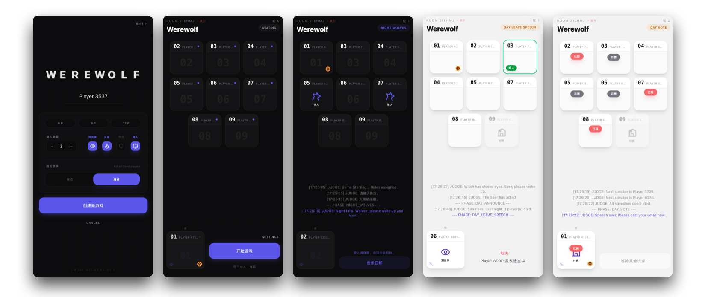

# 🐺 Werewolf Local | 极简局域网狼人杀



[English](#english) | [中文](#中文)

---

<a name="english"></a>
## 🌍 English

**Werewolf Local** is a minimalist, modern party game designed specifically for local network play. Forget about online matchmaking lag—just gather your friends on the same WiFi, scan a QR code, and start hunting the wolf.

### ✨ Key Features
- **Zero-Config Local Play**: Host a game on your laptop, and everyone else joins via their mobile browser. No app installation required.
- **Dynamic Theming**: The UI automatically switches between **Day (Light Mode)** and **Night (Dark Mode)** based on the game phase.
- **Modern Aesthetics**: Premium minimalist design with glassmorphism, smooth transitions, and a cool landing page glitch effect.
- **Optimized for Mobile**: Responsive player grid and control panel designed for one-handed play.
- **Standard Presets**: Built-in support for 6P (Newbie), 9P (Common), and 12P (Standard) configurations with balance-tuned rules.
- **Voice Announcements**: Built-in judge voice (Chinese) to guide the game flow.

### 🚀 Quick Start
1. **Clone & Install**:
   ```bash
   git clone https://github.com/SonghaiFan/werewolf_local_game.git
   cd local-werewolf
   npm install
   ```
2. **Launch**:
   ```bash
   npm start
   ```
3. **Connect**:
   - The terminal will display your **Local Network IP** (e.g., `192.168.x.x`).
   - The host can open `http://localhost:5173`.
   - Players scan the **QR Code** on the host's screen to join.

---

<a name="中文"></a>
## 🇨🇳 中文

**Werewolf Local** 是一款专为局域网设计的极简现代狼人杀。告别繁琐的网络匹配和延迟，只需所有人在同一个 WiFi 下，扫码即可开局，享受最纯粹的面杀体验。

### ✨ 核心特性
- **零配置开局**：在电脑上点击“创建”，其他玩家通过手机浏览器扫码加入。无需下载任何 App。
- **昼夜动态主题**：UI 会根据游戏进程自动切换 **白天（亮色模式）** 与 **夜晚（深色模式）**。
- **现代美学设计**：采用极简主义设计，结合毛玻璃效果、平滑动画以及充满高级感的首屏故障艺术效果。
- **移动端优化**：专为单手操作设计的玩家矩阵和控制面板。
- **标准预设配置**：内置 6人（新人局）、9人（标准局）、12人（进阶局）预设方案，平衡性经过精心调整。
- **语音广播**：内置中文法官语音，指引游戏进程，解放上帝。

### 🚀 快速启动
1. **构建与安装**：
   ```bash
   git clone https://github.com/SonghaiFan/werewolf_local_game.git
   cd local-werewolf
   npm install
   ```
2. **启动项目**：
   ```bash
   npm start
   ```
3. **连接加入**：
   - 终端会显示你的 **局域网 IP**（例如 `192.168.x.x`）。
   - 房主打开 `http://localhost:5173`。
   - 玩家使用手机扫描房主屏幕上的 **二维码** 即可快速加入游戏。

---

### 🛠 Tech Stack / 技术栈
- **Frontend**: React, Vite, Tailwind CSS, Framer Motion
- **Backend**: Node.js, Express, Socket.io
- **Icons**: Custom SVG Set

### 📜 License
MIT License. Feel free to use and modify for your own local parties!
